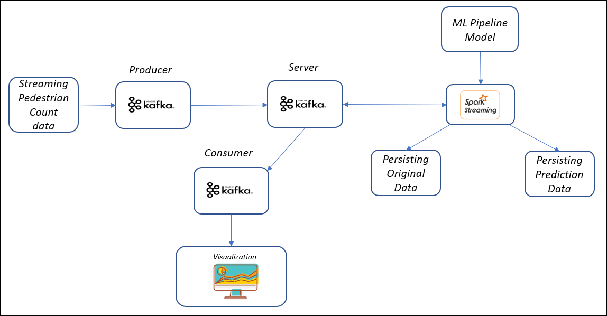

# pedestrian-traffic-prediction
Predicting the Pedestrian Traffic Using PySpark

In this project we would be using the following architectures:
1. For the Model building process:  

  

2. For the real-time modelling and visualization process:  

To understand about these things deeply refere to the medium articles **[Time Series Prediction using Spark](https://pub.towardsai.net/time-series-prediction-using-spark-8ee7fbe878e6)** and **[Predicting and Visualizing streaming Data through Python](https://pub.towardsai.net/predicting-and-visualizing-streaming-data-through-python-2670003bc809)** where both the architectures have been explained in details.
